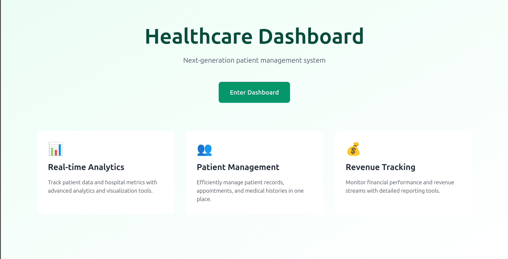
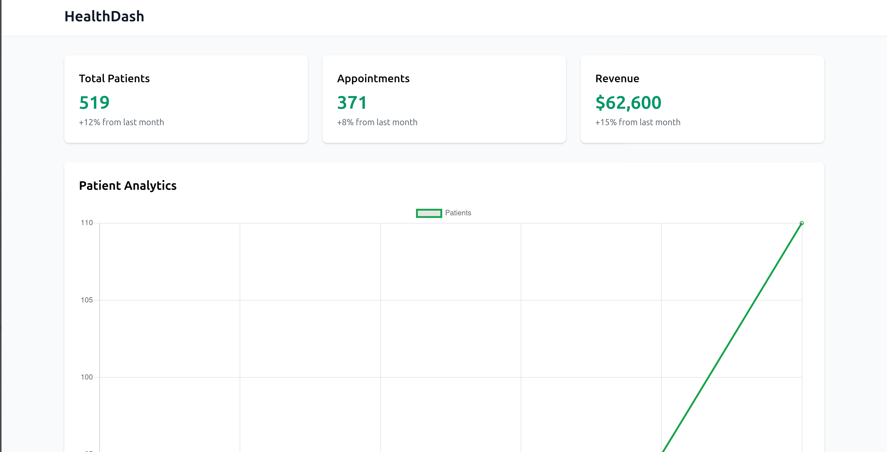
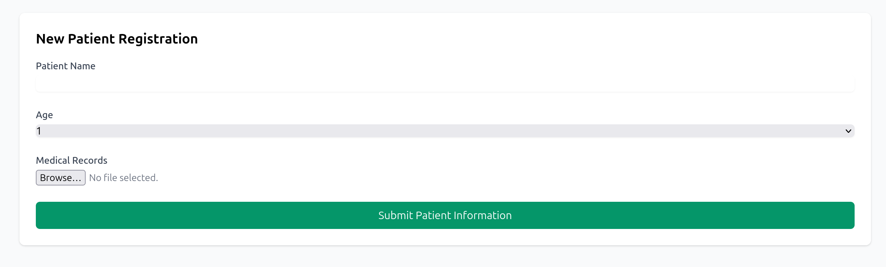

# HealthDash - Healthcare Management Dashboard

A modern and intuitive healthcare management system with real-time analytics, patient tracking, and revenue monitoring capabilities.

## Features

- Real-time patient analytics and statistics
- Interactive data visualization with Charts.js
- Patient registration system
- Revenue tracking and monitoring
- Responsive design for all devices
- Smooth animations and transitions

## Screenshots

### Landing Page


### Dashboard


### Patient Registration


## Demo Video
[Watch the demo video here](https://youtu.be/ordnR8KXFhE)

## Technologies Used

### Frontend
- HTML5
- TailwindCSS
- Alpine.js
- Chart.js
- JavaScript

### Backend
- Python
- Flask

### Development Tools
- Visual Studio Code
- Git
- GitHub
- Chrome DevTools

## Getting Started

1. Clone the repository
```bash
git clone https://github.com/yourusername/healthdash.git
```

2. Install dependencies
```bash
pip install flask
```

3. Run the application
```bash
python app.py
```

4. Open your browser and navigate to http://localhost:5000

## Project Structure
```bash
healthdash/
├── app.py
├── static/
│   ├── css/
│   └── js/
├── templates/
│   ├── index.html
│   └── dashboard.html
└── README.md
```
## Contributing
Feel free to submit issues, fork the repository, and create pull requests for any improvements.
